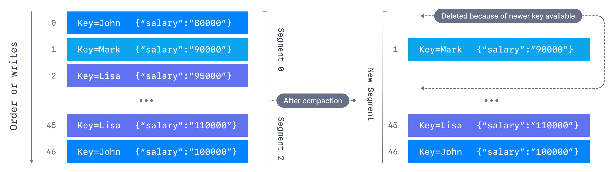

# Kafka Tutorial

https://www.conduktor.io/kafka

## Open Source Kafka Startup in local

1. Start Zookeeper Server

    ```sh bin/zookeeper-server-start.sh config/zookeeper.properties```

2. Start Kafka Server / Broker

    ```sh bin/kafka-server-start.sh config/server.properties```

3. Create topic

    ```sh bin/kafka-topics.sh --bootstrap-server localhost:9092 --create --topic NewTopic --partitions 3 --replication-factor 1```

4. list out all topic names

    ``` sh bin/kafka-topics.sh --bootstrap-server localhost:9092 --list ```

5. Describe topics

    ``` sh bin/kafka-topics.sh --bootstrap-server localhost:9092 --describe --topic NewTopic ```

6. Produce message

    ```sh bin/kafka-console-producer.sh --broker-list localhost:9092 --topic NewTopic```

7. consume message

    ``` sh bin/kafka-console-consumer.sh --bootstrap-server localhost:9092 --topic NewTopic --from-beginning ```

## Kafka Topic Configuration

 With **`topic_name`** is **`configured-topic`**

1. Create

    ```sh
    bin/kafka-topics.sh --bootstrap-server localhost:9092 --create --topic configured-topic --partitions 3 --replication-factor 1
    ```

2. Describe

    ```sh
    bin/kafka-topics.sh --bootstrap-server localhost:9092 --describe --topic configured-topic
    ```

3. Update config

    ```sh
    bin/kafka-configs.sh --bootstrap-server localhost:9092 --alter --entity-type topics --entity-name configured-topic --add-config min.insync.replicas=2
    ```

4. Delete config

    ```sh
    bin/kafka-configs.sh --bootstrap-server localhost:9092 --alter --entity-type topics --entity-name configured-topic --delete-config min.insync.replicas
    ```

5. Segments

    - `log.segment.bytes`: the max size of a single segment in bytes (default 1 GB)
    - `log.segment.ms`: the time Kafka will wait before committing the segment if not full (default 1 week)

6. Log Retention
    - `log.retention.hours` : The most common configuration for how long Kafka will retain messages is by time. The default is 168 hours, the equivalent of one week._If more than one is specified, the smaller unit size will take precedence._
        - `log.retention.minutes`
        - `log.retention.ms`
    - `log.retention.bytes`:  The total number of bytes of messages retained. This value is set using and it is applied per partition.
        - Example:

            ```sh
            kafka-configs.sh --bootstrap-server localhost:9092 --alter --entity-type topics --entity-name configured-topic --add-config retention.ms=-1,retention.bytes=524288000
            ```

7. Minimum In-Sync Replicas

- `acks`

  - When **`acks=0`** producers consider messages as "written successfully" the moment the message was sent without waiting for the broker to accept it at all.If the broker goes offline or an exception happens, we won’t know and will lose data
  - When **`acks=1`** , producers consider messages as "written successfully" when the message was acknowledged by only the leader.Leader response is requested, but replication is not a guarantee as it happens in the background
  - When **`acks=all`**, producers consider messages as "written successfully" when the message is accepted by all in-sync replicas (ISR)

- `min.insync.replicas`

    The `min.insync.replicas` can be configured both at the topic and the broker-level. The data is considered committed when it is written to all in-sync replicas - min.insync.replicas. A value of 2 implies that at least 2 brokers that are ISR (including leader) must respond that they have the data.

 When acks=all with a replication.factor=N and min.insync.replicas=M we can tolerate N-M brokers going down for topic availability purposes

8. Unclean Leader Election

- Enable `unclean.leader.election.enable=true` Unclean leader elections are enabled by default on older versions of Kafka, but they can lead to data loss. If you enable unclean leader elections (or leave them enabled), perform duplicate writes to a secondary cluster if possible

    ```sh
    kafka-configs.sh --bootstrap-server localhost:9092 --alter --entity-type topics --entity-name configured-topic --add-config unclean.leader.election.enable=true
    ```

9. Log Compaction

- **`log.cleanup.policy= delete`** : This is the default for all the user topics. With this policy configured for a topic, Kafka deletes events older than the configured retention time. The default retention period is a week
- **`log.cleanup.policy=compact`** :with the property to only retain at least the most recent value for each key in the partition
  

- Create topic with `cleanup.policy=compact`

  ```sh
  kafka-topics.sh --bootstrap-server localhost:9092 --create --topic employee-salary \
    --partitions 1 --replication-factor 1 \
    --config cleanup.policy=compact \
    --config min.cleanable.dirty.ratio=0.001 \
    --config segment.ms=5000
  ```
